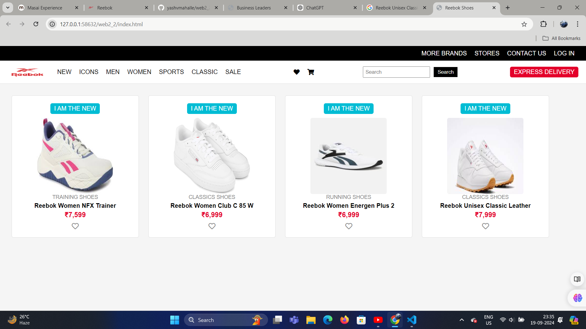

Reebok Shoes Webpage
This project is a basic HTML and CSS webpage designed to showcase various Reebok shoes. The webpage includes features such as product images, names, categories, and prices, along with wishlist functionality.

Features
Product Cards: Each product is displayed as a card with an image, category, name, and price.
Wishlist Icon: A clickable wishlist icon is displayed for each product.
Search Bar: A functional search bar is available to look for products.
Responsive Design: The layout adapts to different screen sizes.
Express Delivery: A prominent "Express Delivery" feature is highlighted.
Step-by-Step Code Breakdown
1. Basic Structure (index.html)
The basic structure of the webpage is an HTML file that includes a top navigation bar, a header, and a main section containing product cards.

2. Top Bar
html
Copy code

  <a href="#">MORE BRANDS</a>
  <a href="#">STORES</a>
  <a href="#">CONTACT US</a>
  <a href="#">LOG IN</a>

This section contains links for navigating to different sections such as brands, stores, and contact details.

3. Header
html
Copy code

  

    

      
    

    <a href="#">NEW</a>
    <a href="#">ICONS</a>
    <a href="#">MEN</a>
    <a href="#">WOMEN</a>
    <a href="#">SPORTS</a>
    <a href="#">CLASSIC</a>
    <a href="#">SALE</a>
  

  

    <a href="#"><i class="fas fa-heart"></i></a>
    <a href="#"><i class="fas fa-shopping-cart"></i></a>
  

  

    <input type="text" placeholder="Search" />
    <button>Search</button>
  

  

    EXPRESS DELIVERY
  

This section contains the logo, navigation links, wishlist and cart icons, a search bar, and an "Express Delivery" badge.

4. Main Product Section
html
Copy code

  

    
I AM THE NEW

    
    
TRAINING SHOES

    
Reebok Women NFX Trainer

    
₹7,599

    
<i class="far fa-heart"></i>

  

  <!-- Add similar divs for other products -->

This section showcases individual products, including their name, category, and price. A wishlist icon is also included.

5. CSS Styling
The page is styled using embedded CSS to define layout, fonts, and other visual elements:

css
Copy code
body {
  font-family: Arial, sans-serif;
  background-color: #f5f5f5;
}

.top-bar {
  background-color: #000;
  color: #fff;
  padding: 10px 20px;
  display: flex;
  justify-content: flex-end;
}

.product {
  background-color: #fff;
  border: 1px solid #ddd;
  padding: 20px;
  margin: 10px;
  text-align: center;
}
This sets up the overall design of the webpage, including color schemes, text alignment, and layout for each section.

How to Run the Project
Clone the repository:
bash
Copy code
git clone https://github.com/YOUR-USERNAME/reebok-shoes-webpage.git
Navigate to the project directory:
bash
Copy code
cd reebok-shoes-webpage
Open the index.html file in your preferred browser:
bash
Copy code
open index.html
Technologies Used
HTML5
CSS3
Font Awesome (for icons)
Future Enhancements
Add more products with detailed descriptions.
Implement a fully functional search bar.
Add interactivity to the wishlist button.
Replace YOUR-USERNAME with your actual GitHub username when creating the repository. Let me know if you need any more details or adjustments!

screenshot of webpage

